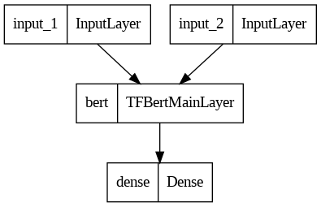
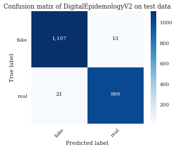
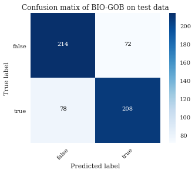
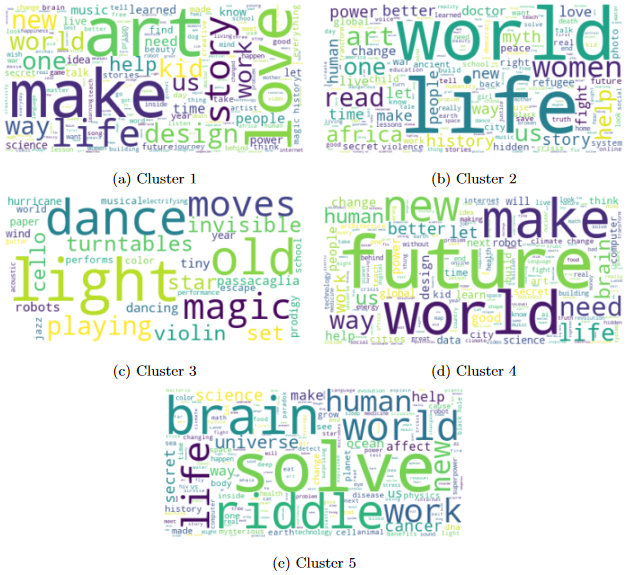
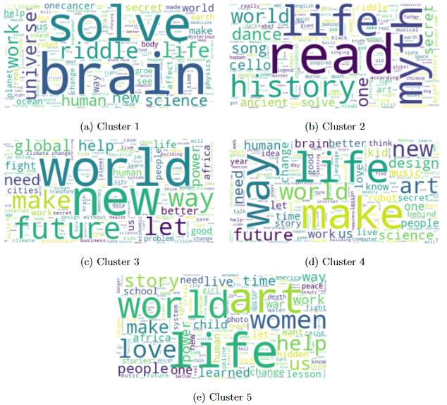
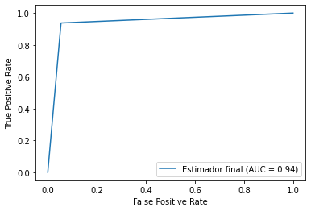
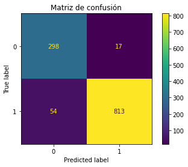

# Santiago González Silot Portfoltio - NLP Data Scientist

## 🎓👨🏽‍💻 [My Thesis - fIlfA: Fake News Detection using BERT, Transformers and NLP](https://github.com/sgonzalezsilot/Thesis-FakeNewsDetection) 📰⁉️

This poster briefly summarizes the work done during my thesis:

* An analysis of the main datasets available for the detection of fake news has been carried out. 
* **Comparison between 7 BERT and RoBERTa models** (4 for English and 3 for Spanish) with **4 different optimization and regularization techniques specialized for word embeddings**. Giving a total of **28 different models tested**.
* **Results very close to the winners of the Iberlef and Constraint AAAI competitions were obtained using a considerably simpler model**.
* **The project resulted in the publication of a paper in the International Seminar on Artificial Intelligence and Disinformation.** https://sites.google.com/go.ugr.es/aidisinfo2022/registration?authuser=0&pli=1
* Implementation of a basic web interface for the use and access to the models. Currently **it can be accessed through HuggingFace**: 
https://huggingface.co/spaces/sgonzalezsilot/Fake-News-Twitter-Detection_from-my-Thesis

|  Model  |  F1-Score | Place in the competition | Difference with the winner |
|:-------:|:---------:|:------------------------:|----------------------------|
| English | **98.41** |             8            | 0.2                        |
| Spanish | **73.77** |             5            | 2.89                       |

## Model architecture

## Fake News in English

## Fake News in Spanish

## [Project 1: Analysis of +4000 TED Talks topics using document clustering](https://github.com/sgonzalezsilot/TedTalksClustering): 
* **Comparison of clustering formed using tf-idf and word embeddings** using the most commons clustering algorithms like **KMeans, Gaussian Mixture Models and Agglomerative Clustering**.
* Tuning of the hyperparameters of all models.
* Comparaison of the results using **multiple clustering metrics (DBI, Silhoutte and Calinski)**.
* Bonus experiment using only the **most relevant tf-idf words and partly solving the curse of dimensionality**.
* Bonus experiment using word embeddings from Microsoft MiniLM-L12-H384.
* Final analysis using **wordclouds and n-grams to identify the topics**.
* **Found insights about which algorithms and metrics work best for document clustering and why**.
* I used cuML, Spark (PySpark) and sentence-transformers.

## [Project 2: Pneumonia Detection with Chest X-Ray Images](https://github.com/sgonzalezsilot/FinalProjectComputerVision): 
* Build a CNN (Convolutional Neural Network) to detect pneumonia with chest x-ray images.
* **Fine-Tuned Resnet50** (trained with Imagenet) to obtain **94.54% accuracy**.
* We apply ImageDataGenerator to balance the classes.
* We used TensorFlow and Scikit-Learn.

Still in progress...
